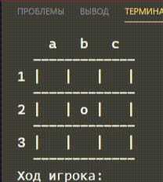

МИНИСТЕРСТВО НАУКИ  И ВЫСШЕГО ОБРАЗОВАНИЯ РОССИЙСКОЙ ФЕДЕРАЦИИ

Федеральное государственное автономное образовательное учреждение высшего образования
"КРЫМСКИЙ ФЕДЕРАЛЬНЫЙ УНИВЕРСИТЕТ им. В. И. ВЕРНАДСКОГО"
ФИЗИКО-ТЕХНИЧЕСКИЙ ИНСТИТУТ
Кафедра компьютерной инженерии и моделирования
<br/><br/>
​
### Отчёт по лабораторной работе № 4<br/> по дисциплине "Программирование"
<br/>
​
Cтудента 1 курса группы ПИ-б-о-191(2)<br/>
Влахова Артема Александровича<br/>
направления 09.03.04 "Программная инженерия"<br/>
<br/>
​
<table>
<tr><td>Научный руководитель<br/> старший преподаватель кафедры<br/> компьютерной инженерии и моделирования</td>
<td>(оценка)</td>
<td>Чабанов В.В.</td>
</tr>
</table>
<br/><br/>
​
Симферополь, 2019

* * *

## Цель:

1. Закрепить навыки работы с перечислениями;
2. Закрепить навыки работы с структурами;
3. Освоить методы составления многофайловых программ.

## Ход работы

Первым делом, после создания основного файла main.cpp, я создал заголовочный файл Game.h, в котором описал все требуемые прототипы и структуры с перечислениями. В дальнейшем, функции я буду реализовывать в файле Game.cpp.

Я так же реализовал захиту от повторного включения файла, используя директивы препроцессора #ifndef и #define (Рис. 1 и 2):

\
*Рис.1 Начало файла Game.h*

\
*Рис.2 Конец файла Game.h (т.е. весь файл обёрнут в #ifndef)*

### Game.h

```cpp
#ifndef GAME_H
#define GAME_H

/* Состояния игры */
enum Status {
   PLAY,            // Игра продолжается
   USER_WIN,        // Игрок победил
   BOT_WIN,         // Бот победил
   NOT_WIN          // Ничья. Победителя нет, но и на поле нет свободной ячейки
};

// Ширина и высота поля
#define BOARD_W  3
#define BOARD_H  3
struct Game {
   char board[BOARD_H][BOARD_W];  // Игровое поле
   bool isUserTurn;  // Чей ход. Если пользователя, то isUserTurn = true
   char userChar;    // Символ которым играет пользователь
   char botChar;     // Символ которым играет бот
   Status status;
};


/**
* Выполняет следующие действия:
*  1. Очищает игровое поле заполняя его пробелами
*  2. Случайным образом определяет чей ход
*  3. Устанавливает симвод для Игрока (Задаётся параметром userChar)
*  4. Устанавливает символ для бота
*  5. Возвращает заполненную структуру
*/
Game initGame(char userChar);

/**
* Выполняет следующие действия:
*  1. Очищает экран
*  2. Отображает содержимое игрового поля. Например так (можно по своему):
*         a   b   c
*       -------------
*     1 | O | O | X |
*       -------------
*     2 |   |   |   |
*       -------------
*     3 |   |   | X |
*       -------------
*/
void updateDisplay(const Game game);

/**
 * Выводит в консоль координаты в формате "nA"
 * где 'n' - col + 1
 *     'A' - (char)(row + 'a')
 *  Пример: (1, 2) -> "2c"; (0, 0) -> "1a".
 */
void printCoords(int col, int row);

/**
* Выполняет ход бота. В выбранную ячейку устанавливается символ которым играет бот.
* Бот должен определять строку, столбец или диагональ в которой у игрока больше всего
* иксиков/ноликов и ставить туда свой символ. Если на поле ещё нет меток, бот должен ставить
* свой знак в центр. В остальных случаях бот ходит рандомно.
*/
void botTurn(Game* game);

/**
* Функция отвечает за ход игрока. Если игрок вводит не допустимые
* значения, ругнуться и попросить ввести заново
*/
void userTurn(Game* game);

/**
* Функция определяет как изменилось состояние игры после последнего хода.
* Функция сохраняет новое состояние игры в структуре game и передаёт ход другому
* игроку.
* Функция возвращает true, если есть победитель или ничья, иначе false.
*/
bool updateGame(Game* game);

#endif
```

При написании Game.cpp я описал две дополнительные структуры - BoardCount и WholeBoardCount:

```cpp
// Структура для удобного хранения статуса одного игрока
struct BoardCount {
    // Количество клеток одного из игроков на всех строках, столбцах и диагоналях
    int cols[3] = {};
    int rows[3] = {};
    int diag[2] = {};

    enum Diags {
        MAIN,       // Основная диагональ
        SECONDARY   // Вспомогательная диагональ
    };

    // Индексы, где будут храниться максимальные значения
    int maxCol = 0;
    int maxRow = 0;
    Diags maxDiag = MAIN;

    // Указывает, если поле в целом пустое от ходов двух игроков.
    bool fieldIsEmpty = false;
};

struct WholeBoardCount {
    BoardCount user;
    BoardCount bot;

    bool fieldIsFull;
};
```

А так же вспомогательную функцию *getBoardCount*, которая выполняет подсчёт полей описанной структуры. Именно основываясь на данных этой структуры бот принимает решение о своём ходе, а функция updateGame выносит вердикт о чьей-то победе или ничье.

### Game.cpp

```cpp
#include <iostream>
#include "Game.h"

using std::max;

Game initGame(char userChar) {
    // Создаём структуру
    Game game;

    // Очищаем поле
    for (int i = 0; i < BOARD_H; i++) {
        for (int j = 0; j < BOARD_W; j++) {
            game.board[i][j] = ' ';
        }
    }

    // Устанавливаем ход пользователя с шансом 50%
    game.isUserTurn = (rand() % 2 == 0);

    // Устанавливаем символы игроков
    game.userChar = userChar;
    game.botChar  = userChar == 'x' ? 'o' : 'x';

    game.status = PLAY;

    return game;
}

void updateDisplay(const Game game) {
    // Очищаем экран
    system("clear");

    /* Вывод на экран */
    std::cout << "    a   b   c\n";
    for (int i = 0; i < 3; i++) {
        std::cout << "  -------------\n";
        // Номер строки
        std::cout << i + 1 << ' ';

        // | x |
        for (int j = 0; j < 3; j++) {
            std::cout << "| " << game.board[i][j] << " ";
        }
        std::cout << "|\n";
    }
    // Нижняя черта
    std::cout << "  -------------\n";
}

void printCoords(int col, int row) {
    std::cout << col + 1 << static_cast<char>(row + 'a');
}

// Структура для удобного хранения статуса одного игрока
struct BoardCount {
    // Количество клеток одного из игроков на всех строках, столбцах и диагоналях
    int cols[3] = {};
    int rows[3] = {};
    int diag[2] = {};

    enum Diags {
        MAIN,       // Основная диагональ
        SECONDARY   // Вспомогательная диагональ
    };

    // Индексы, где будут хранится максимальные значения
    int maxCol = 0;
    int maxRow = 0;
    Diags maxDiag = MAIN;

    // Указывает, если поле в целом пустое от ходов двух игроков.
    bool fieldIsEmpty = false;
};

enum BoardCountMode {
    USER,
    BOT
};
// Подсчитывает boardCount выбранного игрока (см. описание boardCount выше)
BoardCount getBoardCount(const Game game, BoardCountMode bcm) {
    BoardCount bc;
    // Символ выбранного игрока
    char playerChar = (bcm == USER) ? game.userChar : game.botChar;


    /* Анализ поля */
    bc.fieldIsEmpty = true;
    for (int col = 0; col < 3; col++) {
        for (int row = 0; row < 3; row++) {
            if (game.board[col][row] != ' ') bc.fieldIsEmpty = false;

            // Подсчёт клеток выбранного игрока
            if (game.board[col][row] == playerChar) {
                bc.cols[col]++;
                bc.rows[row]++;

                if (col == row) bc.diag[BoardCount::MAIN]++;
                if (2 - col == row) bc.diag[BoardCount::SECONDARY]++;  // col row: 2 0; 1 1; 0 2;

                // Анализ максимальных значений
                if (bc.cols[col] > bc.cols[bc.maxCol]) bc.maxCol = col;
                if (bc.rows[row] > bc.rows[bc.maxRow]) bc.maxRow = row;

                if (bc.diag[BoardCount::MAIN] > bc.diag[BoardCount::SECONDARY]) bc.maxDiag = BoardCount::MAIN;
                else bc.maxDiag = BoardCount::SECONDARY;
            }
        }
    }

    return bc;
}

// Подсчёт максимального количество клеток "рядом" - на диагонали, в строке или столбце
int countNearby(const BoardCount bc) {
    // Максимум из трёх
    return max(
        bc.cols[bc.maxCol],
        max(
            bc.rows[bc.maxRow],
            bc.diag[bc.maxDiag]
        )
    );
}

// Структура для удобного хранения статуса всей доски
struct WholeBoardCount {
    BoardCount user;
    BoardCount bot;

    bool fieldIsFull;
};

WholeBoardCount getWholeBoardCount(const Game game) {
    BoardCount user = getBoardCount(game, USER);
    BoardCount bot = getBoardCount(game, BOT);

    WholeBoardCount wbc {user, bot, true};

    for (int col = 0; col < 3; col++)
        for (int row = 0; row < 3; row++)
            if (game.board[col][row] == ' ') {
                wbc.fieldIsFull = false;
                return wbc;
            }

    return wbc;
}

void botTurn(Game* game) {
    // Количество клеток пользователя на всех строках, столбац и диагоналях
    BoardCount user = getBoardCount(*game, USER);

    /* Принятие решения */
    // std::cout << "Ход компьютера: ";
    if (user.fieldIsEmpty) {
        // Ходим в центр
        std::cout << "2b\n";
        game->board[1][1] = game->botChar;

        return;
    }

    // Если поле не пустое, сравниваем между собой полученные значения
    int C = user.cols[user.maxCol],
        R = user.rows[user.maxRow],
        D = user.diag[user.maxDiag];

    // Если количество клеток в каком-то столбце строго больше, чем в других диагоналях и строках
    if (C > max(R, D)) {
        // Выбираем свободную клетку на этом столбце
        int row;
        for (row = 0; row < 3; row++)
            if (game->board[user.maxCol][row] == ' ') break;

        game->board[user.maxCol][row] = game->botChar;
        //printCoords(user.maxCol, row); std::cout << '\n';
    }
    // Если количество клеток в какой-то строчке строго больше, чем в других диагоналях и строках
    else if (R > max(C, D)) {
        // Выбираем случайную свободную клетку на этой строчке
        int col;
        for (col = 0; col < 3; col++)
            if (game->board[col][user.maxRow] == ' ') break;

        game->board[col][user.maxRow] = game->botChar;
        //printCoords(col, user.maxRow); std::cout << '\n';
    }
    // Если количество клеток в какой-то диагонали строго больше, чем в других строках и столбцах
    else if (D > max(C, R)) {
        // Выбираем случайную свободную клетку на этой диагонали
        if (user.maxDiag == BoardCount::MAIN) {
            int i;
            for (i = 0; i < 3; i++)
                if (game->board[i][i] == ' ') break;

            game->board[i][i] = game->botChar;
            //printCoords(i, i); std::cout << '\n';
        }
        else {
            int i;
            for (i = 0; i < 3; i++)
                if (game->board[i][2 - i] == ' ') break;

            game->board[i][2 - i] = game->botChar;
            //printCoords(i, 2 - i); std::cout << '\n';
        }
    }
    // Действуем случайно
    else {
        int col, row;
        do {
            col = rand() % 3;
            row = rand() % 3;
        }
        while (game->board[col][row] != ' ');

        game->board[col][row] = game->botChar;
        printCoords(col, row); std::cout << '\n';
    }
}

void userTurn(Game* game) {
    std::string answer;
    bool inputIsValid;
    int col, row;
    do {
        std::cout << "Ход игрока: ";
        std::cin >> answer;

        col = (answer[0] - '0') - 1;
        row = answer[1] - 'a';

        if ((col < 0 || col >= 3) || (row < 0 || row >= 3)) {
            // Обязательно нужно ругнуться.
            std::cout << "Ah s**t... Вы ввели недопустимые координаты\n";
            inputIsValid = false;
        }
        else if (game->board[col][row] != ' ') {
            // Ругаемся по ТЗ.
            std::cout << "Ah s**t... В этой клетке уже стоит '" << game->board[col][row] << "'!\n";
            inputIsValid = false;
        }
        else inputIsValid = true;

    } while (!inputIsValid);

    game->board[col][row] = game->userChar;
}

bool updateGame(Game* game) {
    // Если игра уже завершена, её не нужно обновлять
    if (game->status != PLAY) return true;

    // Статус двух игроков и их клеток
    WholeBoardCount wbc = getWholeBoardCount(*game);

    // Подсчитываем максимальное количество клеток на строчке/столбце/диагонали каждой стороны
    int botMaxNearby = countNearby(wbc.bot);
    if (botMaxNearby == 3) {
        // Бот победил
        game->status = BOT_WIN;
        std::cout << "Бот победил!\n";
        return true;
    }

    int userMaxNearby = countNearby(wbc.user);
    if (userMaxNearby == 3) {
        // Пользоваель победил
        game->status = USER_WIN;
        std::cout << "Вы победили!\n";
        return true;
    }

    if (wbc.fieldIsFull) {
        // Ничья
        game->status = NOT_WIN;
        std::cout << "Ничья!\n";

        return true;
    }

    // Игра продолжается
    game->isUserTurn = !game->isUserTurn;

    return false;
}
```

Последним шагом было написать программу для main, которая будет запускать игру и необходимые для неё функции.

### main.cpp

```cpp
#include <iostream>

#include "Game.h"

int main() {
    setlocale(LC_ALL, "Russian");
    srand( time(nullptr) );

    Game game = initGame('x');
    updateDisplay(game);
    do {
        if (game.isUserTurn) userTurn(&game);
        else botTurn(&game);

        updateDisplay(game);
    } while(!updateGame(&game));
}
```

Запуск программы я производил из консоли, поэтому моя компиляция происходила следующим образом (чтобы включить оба файла):

```bash
g++ main.cpp Game.cpp -o main
```

И запуск:

```bash
./main
```

Гифка, демонстрирующая работу программы (Рис. 3):

\
*Рис.3 Демострация работы программы*

На ней видно одну ничью и одну победу. На рисунке 4 можно увидеть запись другой игры в большем масштабе, чем на рисунке 3.

\
*Рис.4 Демонстрация работы программы №2*

* * *

## Вывод

Я закрепил навыки работы с перечислениями, закрепил навыки работы со структурами, освоил иетоды составления многофайловых программ.
