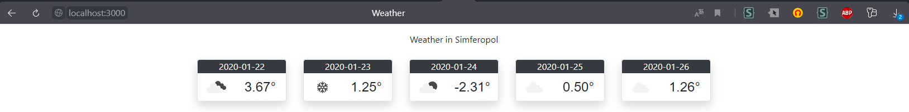

МИНИСТЕРСТВО НАУКИ  И ВЫСШЕГО ОБРАЗОВАНИЯ РОССИЙСКОЙ ФЕДЕРАЦИИ

Федеральное государственное автономное образовательное учреждение высшего образования
"КРЫМСКИЙ ФЕДЕРАЛЬНЫЙ УНИВЕРСИТЕТ им. В. И. ВЕРНАДСКОГО"
ФИЗИКО-ТЕХНИЧЕСКИЙ ИНСТИТУТ
Кафедра компьютерной инженерии и моделирования
<br/><br/>
​
### Отчёт по лабораторной работе № 6<br/> по дисциплине "Программирование"
<br/>
​
Cтудента 1 курса группы ПИ-б-о-191(2)<br/>
Влахова Артема Александровича<br/>
направления 09.03.04 "Программная инженерия"<br/>
<br/>
​
<table>
<tr><td>Научный руководитель<br/> старший преподаватель кафедры<br/> компьютерной инженерии и моделирования</td>
<td>(оценка)</td>
<td>Чабанов В.В.</td>
</tr>
</table>
<br/><br/>
​
Симферополь, 2019

* * *

## Цель:

1. Закрепить навыки разработки многофайловыx приложений;
2. Изучить способы работы с API web-сервиса;
3. Изучить процесс сериализации/десериализации данных.

## Ход работы

### Подготовка серверной части

Для подготовки серверной части моим первым шагом было скачать необходимую библиотеку (Рис. 1) и поместить его в папку к созданному проекту (Рис. 2).

\
*Рис.1 Скачанный репозиторий с cpp-httplib*

\
*Рис.2 Скопированный httplib.h в include/*

В свойствах проекта я указал папку с включаемыми файлами (Рис. 3):

\
*Рис.3 Дополнительные каталоги включаемых файлов*

Изучив базовый пример сервера, я запустил "Hello World" (Рис. 4 и 5), а потом модифицировал код так, чтобы запуск производился на нужном нам порту - 3000 (Рис. 6 и 7):

\
*Рис.4 Скопированный пример сервера*

\
*Рис.5 Вывод браузера при открытии страницы "localhost:1234"*

\
*Рис.6 Изменённая строчка для работы на :3000*

\
*Рис.7 Вывод браузера при открытии страницы "localhost:3000"*

### Подготовка к работе с сервисом openweathermap.org

Для работы с этим сервисом необходим API ключ, который можно получить после регистрации (Рис. 8). Именно через этот ключ происходит авторизация пользователя при использовании самого погодного API.

\
*Рис.8 Полученный API ключ*

```plaintext
814ab893bb16e47e5c33b70202f2dd7d
```

С его помощью я сделал первый тестовый запрос, получив прогноз погоды на 5 дней (Рис. 9). Красными стрелочками отмечены два важных параметра в выполненном GET запросе: город (q=) и API ключ (appid=).

\
*Рис.9 Полученный прогноз погоды*

Чтобы получить результат в метрической системе (температуру в градусах Цельсия, а не Фаренгейта), необходимо дописать ещё один параметр "units", через который нужно передать "metric"

Финальный GET запрос выглядит следующим образом:

```plaintext
api.openweathermap.org/data/2.5/forecast?q=Simferopol&appid=814ab893bb16e47e5c33b70202f2dd7d&units=metric
```

### Подготовка клиента для получения информации от openweathermap.org

Скопировав пример совершения GET запросов, я вставил туда нужные данные для получения JSON с погодой (Рис. 10).

\
*Рис.10 Результат работы тестовой программы по совершению GET запроса*

Программа отработала отлично и вернуло именно тот JSON, что я видел в браузере.

### Подготовка к работе с JSON

JSON необходимо десериализировать, чтобы я смог извлечь из него информацию. Для этой цели я скачал библиотеку nlohmann-a для работы с JSON и поместил её в папку include/ (Рис. 11).

\
*Рис.11 nlohmann/json.hpp в include/*

Следующим моим шагом было десериализировать полученную информацию и для теста работоспособности вывести город, для которого получен прогноз (Рис. 12).

\
*Рис.12 Корректно отображённый город*

### Подготовка шаблона виджета

С [cpp.codelearn.ru](http://cpp.codelearn.ru/lab/lab6files/informer_template.html) я скачал *informer_template.html* и поместил на одном уровне с основным cpp файлом (Рис. 13).

\
*Рис.13 Расположение Template.html*

В коде я реализовал считывание файла используя ifstream и std::getline (Рис. 14).

\
*Рис.14 Чтение всего файла в переменную*

### Сборка итогового проекта

Для заполнения шаблона я реализовал функцию *fillTemplate*, принимающую в себя строку шаблона, подстроку и вектор значений. Функция находит все вхождения подстроки и заменяет их на элементы вектора:

```cpp
// Заменяет определённую подстроку в шаблоне на значения из массива по очереди
void fillTemplate(std::string* t, const std::string& substr, const std::vector<std::string>& values)
{
    size_t index = 0;
    int values_ind = 0;
    while (true) {
        // Находим подстроку
        index = t->find(substr, index);
        if (index == std::string::npos) break;

        // Делаем замену
        t->erase(index, substr.size());
        t->insert(index, values[values_ind]);

        // На всякий случай, "перематываем" индекс вперёд, чтобы подстрока не заменилась на себя (в случае перекрывания)
        index += values[values_ind].size();

        values_ind++;
        if (values_ind >= values.size()) break;
    }
}
```

Таким образом я заполняю строку *Template* данными из JSON, а затем полученные данные отправляю пользователю (Рис. 15).

\
*Рис.15 Заполнение шаблона значениями и выставление контента страницы*

На рисунке 16 можно увидеть пример работы программы (http://localhost:3000)

\
*Рис.16 Пример работы программы*

### Полученный код

```cpp
#include <httplib/httplib.h>
#include <nlohmann/json.hpp>
#include <fstream>
#include <sstream>
#include <set>

const char url[] = "api.openweathermap.org";
const char get_url[] = "/data/2.5/forecast?q=Simferopol&appid=814ab893bb16e47e5c33b70202f2dd7d&units=metric";

// Заменяет определённую подстроку в шаблоне на значения из массива по очереди
void fillTemplate(std::string* t, const std::string& substr, const std::vector<std::string>& values)
{
    size_t index = 0;
    int values_ind = 0;
    while (true) {
        // Находим подстроку
        index = t->find(substr, index);
        if (index == std::string::npos) break;

        // Делаем замену
        t->erase(index, substr.size());
        t->insert(index, values[values_ind]);

        // На всякий случай, "перематываем" индекс вперёд, чтобы подстрока не заменилась на себя (в случае перекрывания)
        index += values[values_ind].size();

        values_ind++;
        if (values_ind >= values.size()) break;
    }
}

struct Data
{
    std::vector<std::string> dates, temps, icons;
    std::string city;
};

std::string extractIcon(const nlohmann::json& json)
{
    auto weather = json["weather"];
    for (auto& el : weather.items())
    {
        return el.value()["icon"];
    }
}

std::string floatToString(float f)
{
    std::stringstream ss;
    ss.precision(2);
    ss << std::fixed << f;
    return ss.str();
}

Data parseData(const nlohmann::json& json)
{
    std::vector<std::string> dates, temps, icons;
    std::set<std::string> alreadyCheckedDate;

    auto city = json["city"]["name"].get<std::string>();

    auto list = json["list"];
    for (auto& el : list.items()) {
        std::string date = el.value()["dt_txt"];
        date = date.substr(0, date.find(' '));

        if (alreadyCheckedDate.find(date) == alreadyCheckedDate.end())
        {
            dates.push_back(date);

            auto temp = el.value()["main"]["temp"].get<float>();

            icons.push_back(extractIcon(el.value()));
            temps.push_back(floatToString(temp));

            alreadyCheckedDate.insert(date);
        }
    }

    return { dates, temps, icons, city };
}

// В этой функции формируем ответ сервера на запрос
void gen_response(const httplib::Request& req, httplib::Response& res) {
    httplib::Client cli(url, 80);

    auto weather_res = cli.Get(get_url);
    if (weather_res && weather_res->status == 200) {
        auto json = nlohmann::json::parse(weather_res->body);

        // Читаем весь файл
        std::ifstream ifs("Template.html");

        std::string Template, buffer;
        while (std::getline(ifs, buffer))
        {
            Template += buffer + '\n';
        }

        Data d = parseData(json);

        fillTemplate(&Template, "{city.name}", { d.city });

        fillTemplate(&Template, "{list.dt}", d.dates);
        fillTemplate(&Template, "{list.weather.icon}", d.icons);
        fillTemplate(&Template, "{list.main.temp}", d.temps);

        res.set_content(Template, "text/html");
    }
    else
        res.set_content("Failed to open api.openweather.org", "text/plain");
}

int main(void)
{
    httplib::Server svr;           // Создаём сервер
    svr.Get("/", gen_response);    // Вызвать функцию gen_response если кто-то обратиться к корню "сайта"
    svr.listen("localhost", 3000); // Запускаем сервер на localhost и порту 3000
}
```

* * *

## Вывод

Я закрепил навыки разработки многофайловых приложений, изучил способы работы API web-сервиса, изучил процесс сериализации/десериализации данных.
