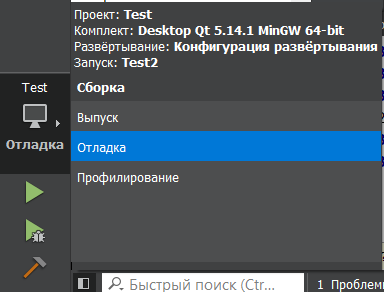
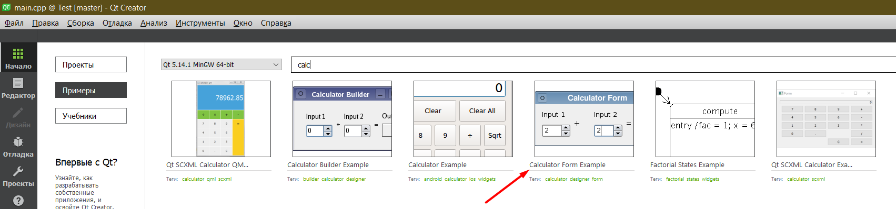

МИНИСТЕРСТВО НАУКИ И ВЫСШЕГО ОБРАЗОВАНИЯ РОССИЙСКОЙ ФЕДЕРАЦИИ\
Федеральное государственное автономное образовательное учреждение высшего образования\
"КРЫМСКИЙ ФЕДЕРАЛЬНЫЙ УНИВЕРСИТЕТ им. В. И. ВЕРНАДСКОГО"\
ФИЗИКО-ТЕХНИЧЕСКИЙ ИНСТИТУТ\
Кафедра компьютерной инженерии и моделирования\
  
​
### Отчёт по лабораторной работе № 7  по дисциплине "Программирование"
 

студента 1 курса группы ПИ-б-о-191(2)\
Влахова Артема Александровича\
направления подготовки 09.03.04 "Программная инженерия"\
 
​
<table>
<tr><td>Научный руководитель  старший преподаватель кафедры компьютерной инженерии и моделирования</td>
<td>(оценка)</td>
<td>Чабанов В.В.</td>
</tr>
</table>
  
​
Симферополь, 2019

* * *

## Цель: _изучить основные возможности создания и отладки программ в IDE Qt Creator_

## Ход работы

    1. Как создать консольное приложение С++ в IDE Qt Creator без использования компонентов Qt?

Консольное приложение (как и аналогичные проекты Qt Creator) создаются в три шага:

* Файл -> Создать файл или проект...
* Выбрать раздел "Проект без Qt", а затем "Приложение на языке C++"
* Выбрать название и расположения проекта, а так же поменять при необходимости другие настройки.

\
*Рис.1 Первый шаг создания проекта*

\
*Рис.2 Выбор типа проекта*

\
*Рис.3 Выбор названия и расположения проекта*

* * *

    2. Как изменить цветовую схему (оформление) среды?

Цветовая схема Qt Creator меняется через "Параметры", расположенные в графе "Инструменты"

* Открыть Инструменты -> Параметры...
* Убедиться, что в левой части открывшегося окна выбрана вкладка "Среда"
* В правой части выбрать нужную цветовую схему

\
*Рис.4 Расположение параметров*

\
*Рис.5 Изменение темы в настройках*

* * *

    3. Как закомментировать/раскомментировать блок кода средствами Qt Creator?

Комментирование и раскомментирование в Qt Creator производится одним сочетанием клавиш, предварительно поставив каретку на нужную строчку.

* *Ctrl + /* комментирует/декомментирует строчку.

Пример работы (см. рис. 6)

\
*Рис.6 Что происходит после нажатия Ctrl + /*

* * *

    4. Как открыть в проводнике Windows папку с проектом средствами Qt Creator?

Открыть проводник для выбора папки можно двумя способами:

* Использовать сочетание клавиш *Ctrl + O*
* Перейти по Файл -> Открыть файл или проект...

После чего в проводнике нужно выбрать *.pro* (файл проекта Qt Creator) и нажать "Открыть"

\
*Рис.7 Расположение кнопки для открытия папки*

* * *

    5. Какое расширение файла-проекта используется Qt Creator?

Qt Creator использует *.pro* в качестве расширения для файла проекта.

\
*Рис.8 Файл проекта Qt Creator*

* * *

    6. Как запустить код без отладки?

Запустить код без отладки можно тремя способами:

* Нажатием _Ctrl + R_
* Навигацией в левую нижнюю часть экрана и нажатию на зеленый треугольник без инонки жука
* Переходом на вкладку Сборка -> Запустить

\
*Рис.9 Запуск без отладки через иконку запуска в левом нижнем углу экрана (конфигурация проекта не важна)*

\
*Рис.10 Запуск без отладки через Сборка -> Запустить*

* * *

    7. Как запустить код в режиме отладки?

Принцип запуска кода в режиме отладки не сильно отличается от запуска без отладки:

* Нажатием _F5_
* Навигацией в левую нижнюю часть экрана и нажатию на зеленый треугольник с инонкой жука
* Отладка -> Начать отладку

\
*Рис.11 Запуск с отладкой через вкладку в верхей части экрана*

\
*Рис.12 Альтернативный способ запустить отладку*

* * *

    8. Как установить/убрать точку остановки (breakpoint)?

Установить и убрать точку остановки можно нажатием на небольшую вертикальную секцию слева от кода и счетчика строк (Рисунок 15)

\
*Рис.13 Установка брейкпойнта*

* * *

    Пункт №9

Я создал программу (Рисунки 16 и 19) с необходимым кодом и выполнил подзадачи.

Результатом оказалось, что в обоих случаях на пятой строчке в этих переменных лежал "мусор" из памяти (Рисунки 17 и 19), которая была для них выделена, но на шестой строчке (после операции присваивания) значение становилось равным 5 (Рисунки 18 и 20)

\
*Рис.14 Переведённый редактор в режим отладки;*

\
*Рис.15 Значение i на пятой строчке*

\
*Рис.16 Значение d на шестой строчке*

\
*Рис.17 Значение i и d на седьмой строчке*

Эти значения не совпадают с теми, что я получал в MSVS, так как и там и там переменные изнально были инициализированны мусором из памяти

* * *

    Пункты №10-17

\
*Рис.18 Нужный нам проект из примеров*

\
*Рис.19 Выбор комплекта сборки*

\
*Рис.20 Запускаем проект (производим сборку)*

\
*Рис.21 Вызванная справка от F1*

\
*Рис.22 Открытая форма "calculatorform.ui"*

\
*Рис.23 Меняем язык путём прописывания нового значения*

\
*Рис.24 Итоговая форма*

* * *

## Вывод

Я изучил основные возможности создания и отладки программ в IDE Qt Creator. Сравнил работу отладчика Qt Creator с отладчиком Visual Studio. Научился менять базовые параметры визуальных компонентов в редакторе дизайна.
