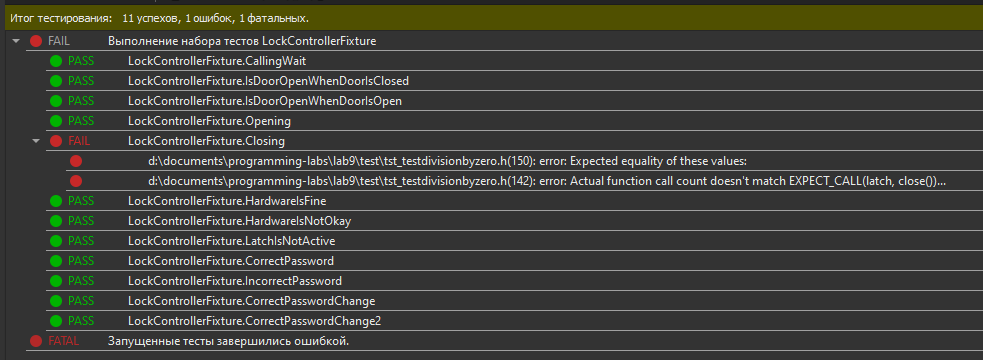

МИНИСТЕРСТВО НАУКИ И ВЫСШЕГО ОБРАЗОВАНИЯ РОССИЙСКОЙ ФЕДЕРАЦИИ\
Федеральное государственное автономное образовательное учреждение высшего образования\
"КРЫМСКИЙ ФЕДЕРАЛЬНЫЙ УНИВЕРСИТЕТ им. В. И. ВЕРНАДСКОГО"\
ФИЗИКО-ТЕХНИЧЕСКИЙ ИНСТИТУТ\
Кафедра компьютерной инженерии и моделирования\
<br/><br/>
​
### Отчёт по лабораторной работе № 9<br/> по дисциплине "Программирование"
<br/>

студента 1 курса группы ПИ-б-о-191(2)\
Влахова Артема Александровича\
направления подготовки 09.03.04 "Программная инженерия"\
<br/>
​
<table>
<tr><td>Научный руководитель<br/> старший преподаватель кафедры<br/>компьютерной инженерии и моделирования</td>
<td>(оценка)</td>
<td>Чабанов В.В.</td>
</tr>
</table>
<br/><br/>
​
Симферополь, 2020

* * *

## Цель: 
1. Познакомиться с Google Test и Google Mock Framework;
2. Изучить базовые понятия относящийся к тестированию кода;
3. Научиться тестировать классы в среде разработки Qt Creator.

## Ход работы

Ссылка на итоговый тестовый проект:
[Test](./Test)

Произведённое тестирование:



_Рисунок №1 - результаты тестирования_

Если изменить метод lockDoor таким образом, тест сможет пройти без ошибок:
```cpp
DoorStatus LockController::lockDoor()
{
    return latch->close();
}
```

Данная ошибка могла возникнуть из-за невнимательности при копировании методов. К примеру, мог быть реализован метод unlockDoor и скопирован ниже, но при редактировании забыли поменять тело и поменяли только название.

* * *

## Вывод

Я изучил основные возможности создания и отладки программ в IDE Qt Creator. Сравнил работу отладчика Qt Creator с отладчиком Visual Studio. Научился менять базовые параметры визуальных компонентов в редакторе дизайна.
